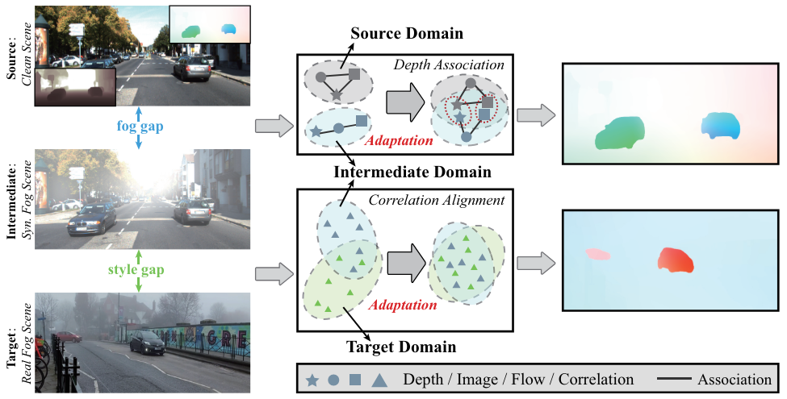
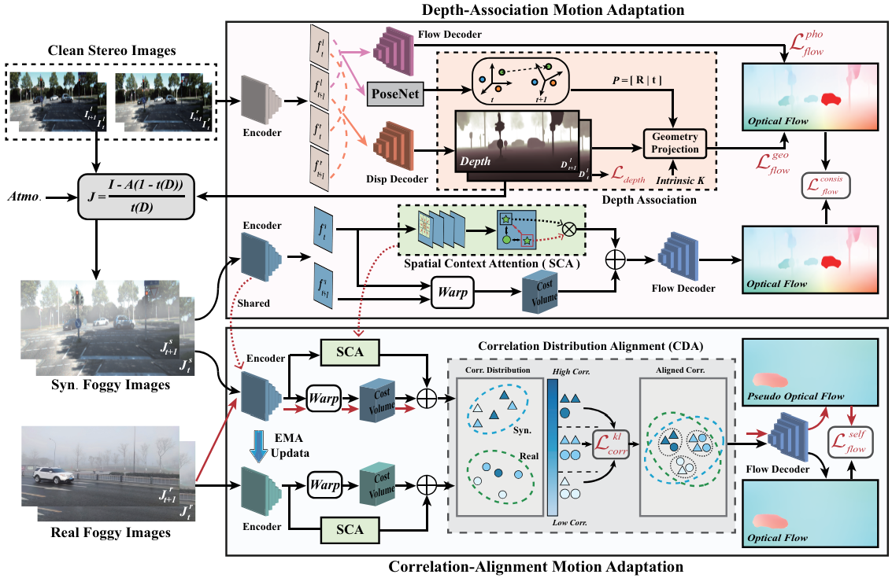
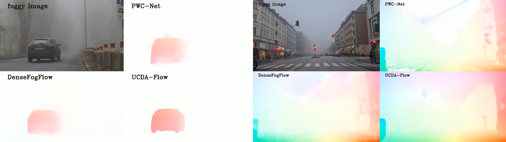

# Unsupervised Cumulative Domain Adaptation for Foggy Scene Optical Flow

## CVPR 2023

### [Paper]([https://arxiv.org/pdf/2503.06934](https://openaccess.thecvf.com/content/CVPR2023/papers/Zhou_Unsupervised_Cumulative_Domain_Adaptation_for_Foggy_Scene_Optical_Flow_CVPR_2023_paper.pdf))

[Hanyu Zhou](https://hyzhouboy.github.io/) $^{1}$, [Yi Chang](https://owuchangyuo.github.io/) $^{1✉}$, [Wending Yan](https://scholar.google.com/citations?hl=en&user=VoFRbrQAAAAJ&view_op=list_works&sortby=pubdate) $^{2}$, [Luxin Yan](https://scholar.google.com/citations?user=5CS6T8AAAAAJ&hl=en) $^{1}$

$^1$ Huazhong University of Science and Technology

$^2$ Huawei International Co. Ltd.

$^✉$ Corresponding Author.







## News

2026.1.2: All details are updated.

2023.07.26: Training code is released.

2023.06.15: Test code and model weight are released.

2023.02.28: Our paper is accepted by CVPR 2023.

## Preparing Dataset

We first should prepare the pre-trained datasets, including clean images, synthetic foggy images and real foggy images. For the clean images, we can obtain them from Internet and open source datasets (*e.g.*, KITTI). For the synthetic data, we refer to the code from the tool.py file to generate the synthetic foggy images:

```
def gemerate_haze(rgb, depth, k, beta):
    # haze_k = k + 0.3 * np.random.rand() # 0.3
    haze_k = k + 0.3 # 0.3
    haze_beta = beta  #0.0001

    transmitmap = np.expand_dims(np.exp(-1 * haze_beta * depth), axis=2)

    tx = np.concatenate([transmitmap, transmitmap, transmitmap], axis=2)
    txcvt = (tx * 255).astype('uint8')
    
    # guided filter smooth the transmit map
    tx_filtered = cv2.ximgproc.guidedFilter(guide=rgb, src=txcvt, radius=50, eps=1e-3, dDepth=-1)

    fog_image = (rgb / 255) * tx_filtered/255 + haze_k * (1 - tx_filtered/255)
    # fog_image = (rgb / 255) + haze_k
    fog_image = np.clip(fog_image, 0, 1)
    # print(fog_image*255)
    fog_image = (fog_image * 255).astype('uint8')
    return fog_image
```

Besides, we also need to self-collect the real foggy images for training. Here, we choose the KITTI as clean version and use the above strategy to generate the corresponding synthetic foggy images. We provide the real foggy dataset [UCDA-Fog](https://drive.google.com/file/d/19niZjG_IvC0NZUDZ2ELVlt73BdvHHfdn/view?usp=sharing). 

## Training

We divide the whole training into three stages (please refer to train.sh): initialization, clean-synthetic, synthetic-real transfer.

```
mkdir -p checkpoints
```

Stage 1-A: Initialize flow and depth models of clean domain.

```
python -u main.py --data_dir /home/sdb/zhouhanyu/data \
   --stage kitti --restore_flow_ckpt model/init/raft.pth --restore_disp_ckpt model/init/aanet.pth \
   --gpus 0 1 --num_steps 100000 --batch_size 4 --lr 0.0001 --image_size 288 960 --wdecay 0.00001 --gamma=0.85 --mixed_precision
```

Stage 1-B: Introduce pose knowledge to optimize flow models of clean domain.

```
python -u main.py --data_dir /home/sdb/zhouhanyu/data \
   --stage kitti --restore_flow_ckpt model/raft.pth --restore_disp_ckpt model/aanet.pth \
   --restore_pose_encoder_ckpt model/pose/pose_encoder.pth --restore_pose_decoder_ckpt model/pose/pose.pth \
   --gpus 0 --num_steps 100000 --batch_size 2 --lr 0.0001 --image_size 288 960 --wdecay 0.00001 --gamma=0.85 --mixed_precision
```

Stage 2: Transfer motion knowledge from clean to synthetic foggy domain.

```
python -u main.py --data_dir /home/sdb/zhouhanyu/data \
   --stage kitti_foggy --restore_flow_ckpt model/raft.pth --restore_flow_synimg_ckpt model/ucda_flow_synfog.pth \
   --gpus 0 --num_steps 100000 --batch_size 4 --lr 0.0001 --image_size 288 960 --wdecay 0.00001 --gamma=0.85 --mixed_precision
```

Stage 3: Transfer motion knowledge from synthetic foggy domain to real foggy domain.

```
python -u main.py --data_dir /home/sdb/zhouhanyu/data \
    --stage real_foggy --restore_flow_synimg_ckpt model/ucda_flow_synfog.pth --restore_flow_realimg_ckpt model/ucda_flow_realfog.pth \
    --gpus 0 --num_steps 100000 --batch_size 2 --lr 0.0001 --image_size 288 512 --wdecay 0.00001 --gamma=0.85 --mixed_precision --use_context_attention
```

Note that --use_context_attention is an optional term. Here we provide the trained model files [UCDA-Flow model](https://drive.google.com/file/d/1osPP1HAA-onkwmDMLUW_s95iEGaslA7R/view?usp=sharing).

## Testing

After training or obtaing the trained UCDA-Flow model, we can perform the inference code (please refer to demo.py):

```
python -u demo.py --model model/ucda_flow_realfog.pth --path /path/your_foggy_images --mixed_precision
```



## Citation

If you find this repository/work helpful in your research, welcome to cite this paper and give a ⭐.

```
@inproceedings{zhou2023unsupervised,
  title={Unsupervised cumulative domain adaptation for foggy scene optical flow},
  author={Zhou, Hanyu and Chang, Yi and Yan, Wending and Yan, Luxin},
  booktitle={Proceedings of the IEEE/CVF conference on computer vision and pattern recognition},
  pages={9569--9578},
  year={2023}
}
```

